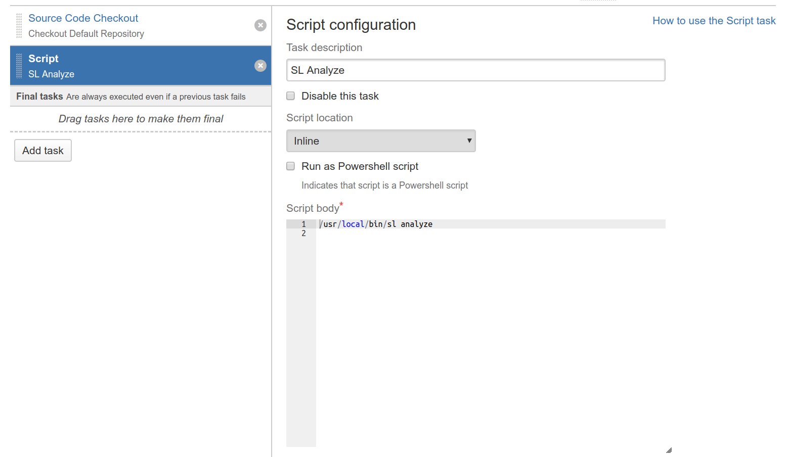
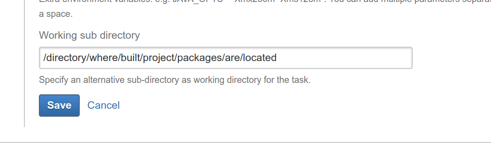

# Integrating Bamboo Builds

This section describes how to integrate Bamboo builds with ShiftLeft

## Bamboo Integration Prerequisites

To integrate Bamboo builds with ShiftLeft, please adhere to the following prerequisites:

- [Bamboo installation](https://confluence.atlassian.com/bamboo/bamboo-installation-guide-289276785.html)
- Supported application and build tool (see [code analysis requirements](../introduction/requirements.md))
- Familiarity with [ShiftLeft Workflow](../getting-started/getting-started.md)
- ShiftLeft account credentials: **Organization ID** and **Upload Token**
Initially these credentials will be provided to you by ShiftLeft. Once you have established your account you can copy them from the **My Profile** page at the ShiftLeft Dashboard.

## Install the CLI and Authenticate

To integrate ShiftLeft with Bamboo builds, install the ShiftLeft CLI on the Bamboo host and authenticate with ShiftLeft:

1. [Install the ShiftLeft CLI](../using-inspect-protect/using-sl-the-shiftleft-cli.md) on the Bamboo host.
2. Log in to the Bamboo server as an administrator. 
3. Create the following **Environment variables**:
 * Name: `SHIFTLEFT_ORG_ID`| Value: Paste your **Organization ID**
 * Name: `SHIFTLEFT_UPLOAD_TOKEN`| Value: Paste your **Upload Token**

See [SL Auth](../using-inspect-protect/associating-with-account.md) for more information.

## Configure the Build

Create a shell script in Bamboo:

1. Select the project.
2. Go to the **Tasks** tab.
3. Add a new task.
4. Select **Script**.
5. Make sure the task you are adding is the last task in the list of build tasks.
6. Enter a task description, such as: **SL Analyze**.
7. Enter the script body: `/usr/local/bin/sl anlyze` or `/usr/local/bin/sl anlyze - -cpg`.
8. Enter working subdirectory: `/directory/where/built/project/packages/are/located`.

