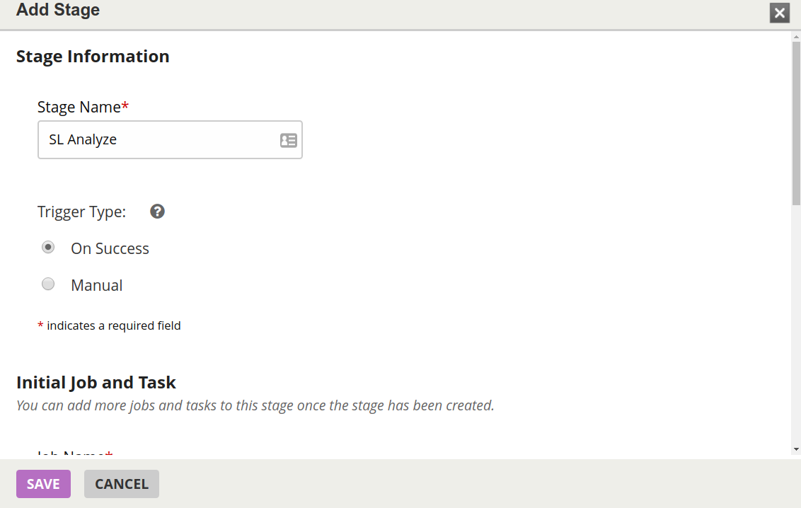
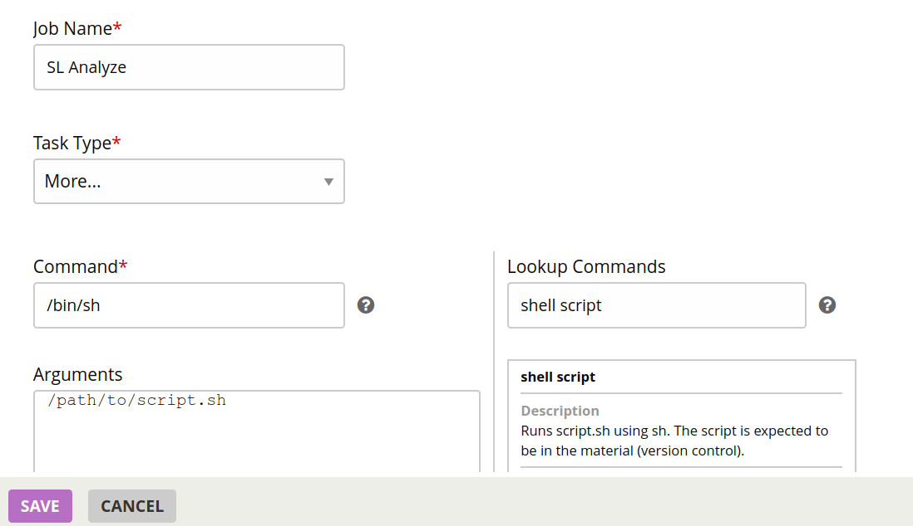

# Integrating GoCD Builds

For CoCD you need to create a script file as part of the build project. With GoCD, all builds occur on agents: either containers or instances. 

## GoCD Integration Prerequisites

To integrate GoCD builds with ShiftLeft, please adhere to the following prerequisites:

- [GoCD installation](https://docs.gocd.org/current/installation/) (server and agent)
- Supported application and build tool (see [code analysis requirements](doc:requirements#section-code-analysis-requirements))
- Familiarity with [ShiftLeft Workflow](doc:getting-started#section-shiftleft-workflow) 
- ShiftLeft account credentials: **Organization ID** and **Upload Token**
Initially these credentials will be provided to you by ShiftLeft. Once you have established your account you can copy them from the **My Profile** page at the ShiftLeft Dashboard.


## Install ShiftLeft CLI and Authenticate

To integrate ShiftLeft with GoCD builds, install the ShiftLeft CLI on the host where the GoCD server is installed and authenticate with ShiftLeft: 

1. [Install the ShiftLeft CLI](doc:cli#section-installation) on the host where GoCD server is installed.
2. Log in to GoCD server as an administrator. 
3. Create the following **Environment variables**:
 * Name: `SHIFTLEFT_ORG_ID`| Value: **Organization ID**
 * Name: `SHIFTLEFT_UPLOAD_TOKEN`| Value: **Upload Token**

See [SL Auth](doc:auth) for more information.

## Copy the SL binary to the agent image

1. Go into a particular GoCD agent image and add the `sl` binary to the agent path at `/usr/local/bin`.
2. Use a terminal editor to add a shell script that consists of these two lines:

```bash
#!/bin/sh

/usr/local/bin/sl analyze
```

Or, to use CPG-mode for analysis:

```bash
#!/bin/sh

/usr/local/bin/sl analyze --cpg
```

3. Check this shell file into the project's repository.

## Configure the Build

Once you have checked in the shell script:

1. Go to the project itself.
2. Click the gear icon or **Settings**.
3. Go to **Stages** tab.
4. Add a new Stage.
- Stage Name: **SL Analyze**
- Trigger Type: **On Success**
- Job Name: **SL Analyze** 
- Task Type: **More**
- Command: **/bin/sh**
- Arguments: `/path/to/script/you/checked/in.sh`
- Working Dir: `/directory/where/built/project/packages`




