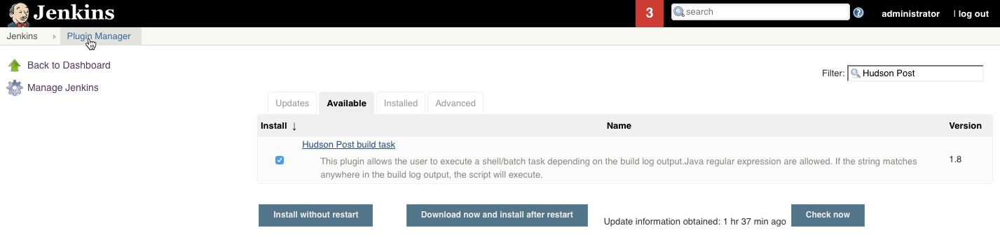
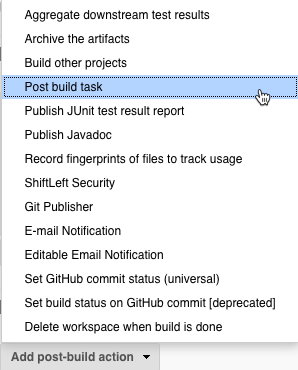

# Configure Post Build Task

This section describes how to integrate ShiftLeft analysis with Jenkins builds by installing the [Hudson Post Build Task Plugin](https://plugins.jenkins.io/postbuild-task) and configure a post build task for each target project.

## Prerequisites

1. Review [Jenkins requirements](integrating-jenkins-builds.md).
2. [Install the ShiftLeft CLI](../../using-inspect-protect/using-sl-the-shiftleft-cli.md) on the host where Jenkins is installed.
3. Create Jenkins environment variables to [authenticate](../../using-inspect-protect/associating-with-account.md) with ShiftLeft and associate Jenkins builds with with your ShiftLeft organization.

## Install the Post Build Task Plugin

To install the Hudson Post Build Task Plugin for Jenkins build integration:

1. Log in to the Jenkins Dashboard (Home screen).
2. Navigate to **Manage Jenkins** > **Manage Plugins**.
3. Select the **Available** tab at the Plugin Manager screen.
4. In the **Filter** search box enter "Hudson Post Build Task Plugin".
5. Check the **Install** task and choose **Install without restart**.
6. Select the **Installed** tab and verify that the plugin is installed.



## Add Post Build Task

Once the plugin is installed you can add a post build action as follows:

1. Log in to the Jenkins Dashboard (Home screen).
2. Navigate to an existing Java server project in the system.
3. Click the **Project Name** and then click **Configure**.
4. Scroll down to the last section of the page and select **Add post-build action**.  
5. Select the **Post build task** option (see screenshot below). 
6. In the **Script** entry field, enter `sl analyze` (or `sl analyze - -cpg`).
7. Click **Save**.




The above shell command assumes that the SL CLI is in your `$PATH`. If it is **NOT**, either put it there (recommended), or use the following command to invoke `sl analyze`:

```bash
#!/bin/bash

pushd <directory where built project packages are located>
/usr/local/bin/sl analyze
popd
```

For example:


