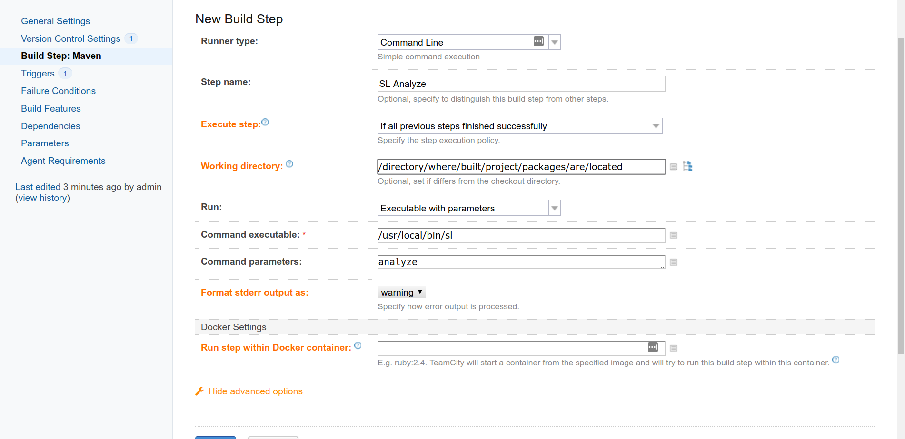

# Integrating TeamCity Builds

Instructions for integrating TeamCity builds with ShiftLeft for code analysis and profiling.

## TeamCity Integration Prerequisites

To integrate TeamCity builds with ShiftLeft, please adhere to the following prerequisites:

- [TeamCity installation](https://www.jetbrains.com/teamcity/download/)
- Supported application and build tool (see [code analysis requirements](doc:requirements#section-code-analysis-requirements))
- Familiarity with [ShiftLeft Workflow](doc:getting-started#section-shiftleft-workflow) 
- ShiftLeft account credentials: **Organization ID** and **Upload Token**
Initially these credentials will be provided to you by ShiftLeft. Once you have established your account you can copy them from the **My Profile** page at the ShiftLeft Dashboard.

## Install the CLI and Authenticate

To integrate ShiftLeft with TeamCity builds:

1. [Install the ShiftLeft CLI](doc:cli#section-installation) on the TeamCity host.
2. Create the following **Environment variables** in TeamCity:
 * Name: `SHIFTLEFT_ORG_ID`| Value: Paste your **Organization ID**
 * Name: `SHIFTLEFT_UPLOAD_TOKEN`| Value: Paste your **Upload Token**

See [SL Auth](doc:auth) for more information. See also the [TeamCity documentation](https://confluence.jetbrains.com/display/TCD65/Configuring+Build+Parameters#ConfiguringBuildParameters-SystemPropertiesandEnvironmentVariables).

## Configure the Build

To create a TeamCity job that executes SL commands:

1. Login to TeamCity.
2. Go to **Project**.
3. Edit **Settings**.
4. Go to **General Settings > Build Configurations**.
5. Click **Edit**.
6. Select **Build Step**.
7. Add **Build Step**.
8. Configure the new build step as follows (see screenshot below):
 - Runner type: Select **Command Line**
 - Step name: **SL Analyze** (for example)
 - Execute step: Select **If all previous steps finished successfully** 
 - Working directory: Enter `/directory/where/built/project/packages/are/located` 
 - Run: Select **Executable with parameters**
 - Command executable: Enter `/usr/local/bin/sl`
 - Command parameters: `analyze` (or `analyze --cpg`)
9. Save the configuration.
10. Run the build and verify analysis success in the command output.

