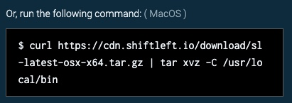

# Quick Start for ShiftLeft Inspect and ShiftLeft Protect

You use ShiftLeft Inspect to analyze your application for vulnerabilites, and ShiftLeft Protect to monitor and protect your application at runtime. To use ShiftLeft, you need:

* A ShiftLeft Account ([contact us](https://www.shiftleft.io/contact/)).
* All [ShiftLeft requirements](../introduction/requirements.md).
* A Java application you want to analyze and protect. You can also use the [HelloShiftLeft demo Java application](https://github.com/ShiftLeftSecurity/HelloShiftLeft) to learn how to use ShiftLeft.

The process for quickly starting with ShiftLeft Inspect and ShiftLeft Protect is:

1. [Choose your operating system](#supported-operating-systems).

2. [Install the ShiftLeft Command Line Interface (CLI)](#installing-the-shiftleft-cli).

3. [Authenticate with ShiftLeft](#authenticating-with-shiftleft).

4. [Run ShiftLeft Protect](#running-shiftleft-protect).

The information in this article parallels and provides additional details on the Quick Start page that you use when you first log into ShiftLeft.

## Supported Operating Systems

ShiftLeft supports the Linux, MacOS X, Windows operating systems.

## Installing the ShiftLeft CLI

The ShiftLeft (CLI) is used with ShiftLeft Inspect to submit applications for analysis and with ShiftLeft Protect to run the ShiftLeft Microagent. The tool is named `sl`.

There are two methods for installing the ShiftLeft CLI: [downloading the installer](#downloading-the-shiftleft-cli-installer) or [running the appropriate CLI install command](#running-the-cli-install-command).

### Downloading the ShiftLeft CLI Installer

To download the ShiftLeft CLI Installer:

1. From the Quick Start page, click the Download the ShiftLeft CLI button.


2. Add the CLI to your system path. The process is different for each operating system, as explained below.

3. Verify the CLI installation by typing `sl help`.

See more information on [Using the ShiftLeft CLI](using-cli/using-cli.md).

#### Linux and MacOS X

Make sure that `/usr/local/bin` is in your `$PATH`.

Extract the `sl/sl.exe` binary and then add the directory location of the `sl` binary to your `$PATH` (or manually copy it to `/usr/local/bin`).

#### Windows .Net

Note that for Windows .NET there are two variants: .NET Framework or .NET Core version. Make sure to pick the right one for your project.

After you have downloaded the appropriate installer, unzip the file and invoke the installer. If you are running the installer from the terminal, add `--no-prompt` to disable waiting for user input.

### Running the CLI Install Command

To run the CLI Install command:

* From the Quick Start page, copy the command and run it from your command line. The command displayed is appropriate to your chosen operating system.



You can also copy the command from here:

#### Linux

```
curl https://cdn.shiftleft.io/download/sl-latest-linux-x64.tar.gz | tar xvz -C /usr/local/bin
```

#### MacOS X

```
curl https://cdn.shiftleft.io/download/sl-latest-osx-x64.tar.gz | tar xvz -C /usr/local/bin
```

#### Windows .NET Framework

```
Invoke-WebRequest -Uri https://cdn.shiftleft.io/download/installer-dotnet-framework-latest-windows-x64.zip -UseBasicParsing -OutFile sl-latest-windows-x64.zip
```

#### Windows .NET Core

```
Invoke-WebRequest -Uri https://cdn.shiftleft.io/download/installer-dotnet-core-latest-windows-x64.zip -UseBasicParsing -OutFile sl-latest-windows-x64.zip
```

## Authenticating with ShiftLeft

To authenticate with ShiftLeft:

* From the Quick Start page, copy the command and run it from your command line. The command automatically includes your unique organization ID and upload token.


Refer to [Authenticating with ShiftLeft](using-cli/authenticating.md) for additional information.

## Running ShiftLeft Protect

ShiftLeft support is available for Java and .NET.

ShiftLeft Protect is run with an application that has been analyzed by ShiftLeft Inspect. The ShiftLeft Protect Microagent runs alongside the application in production (or other environments such as staging, test, UAT). Before running ShiftLeft Protect, you must first use ShiftLeft Inspect to analyze the code of the target application. During code analysis, Shiftleft Inspect generates a Code Property Graph (CPG). The CPG is uploaded to the Shiftleft SaaS where a Security Profile is created for your application. This Security Profile allows ShiftLeft to generate instrumentation custom tailored to the specific version of your application.

Anlaysis of the code can be performed either as a separate step, allowing installation in a build / Continuous Integration (CI) environment, or as part of the same command used for running ShiftLeft Protect.

To analyze the code before running your application, refer to [Analyzing Applications in CI](analyzing-applications-in-ci.md). Note that in this case, you need to carry the produced `shiftleft.json` file to your runtime environment and make it available to the ShiftLeft Protect Microagent. This allows the Microagent to be associated with your application.

To analyze the code during runtime and in at the command line, first verify that you have met the [ShiftLeft Inspect requirements for .NET](../introduction/requirements.md).  Then follow the instructions for analysis using the [ShiftLeft CLI](analyzing-applications-in-ci.md). The system submits your application to the cloud for analysis and waits for the analysis to finish before running the application.

### Running ShiftLeft Protect for Java

In order to start your application with ShiftLeft Protect, you need to prefix the command line to start your application with `sl run`, specifically

```
sl run \
  --app <name>\
  --analyze target/<jar> \
  -- java -jar target/<delimits flags>
```

where

`--app <name>` specifies a unique name for your application.
`--analyze <jar>` points the ShiftLeft CLI (i.e. `sl`) at your application's JAR so that the application is analyzed before starting up.
`-- <delimits flags>` from the command to be wrapped. This is the command used to run ShiftLeft Protect.

After running this command, the Quick Start page is automatically replaced with the ShiftLeft Dashboard.

Note that the first time you run this command for a specific JAR, it takes a few minutes to perform the analyze your application's code. Subsequent runs are faster. You also have the option of pre-analyzing your application, so that starting up is faster.

Once your application is running with ShiftLeft Protect, you can trigger some activity or expose it to real traffic. This activity is shown on the ShiftLeft Dashboard.

For additional information, refer to [Installing ShiftLeft Protect and Configuring the Microagent for Java](protect-java/configuring-the-microagent.md).

### Running ShiftLeft Protect for .Net

To run ShiftLeft Protect .Net, be sure that you:

- Are running on a Windows operating system that has at least .NET Framework Runtime 4.5 installed.
- Analyze the application beforehand [using the ShiftLeft CLI](using-cli.md).

If you are running ShiftLeft Protect with *Internet Information Services (IIS)* you should first copy the `shiftleft.json` file (that was generated during analysis) into the `C:\shiftleftDotNetAgent\spr` directory. You can then start sending requests to your application in the usual manner (e.g., through a browser or a script). The ShiftLeft Protect Microagent is activated once your application receives its first request.

If you are running ShiftLeft Protect with *IIS Express*, start the application through the ShiftLeft CLI as follows:

```
"C:\Program Files\Shiftleft\sl.exe" run --csharp "C:\Program Files\IIS Express\iisexpress.exe" <full path to the project location>
```
