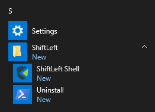
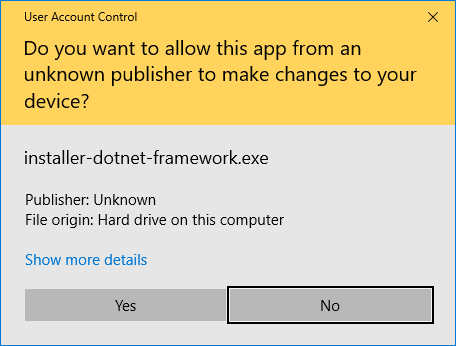
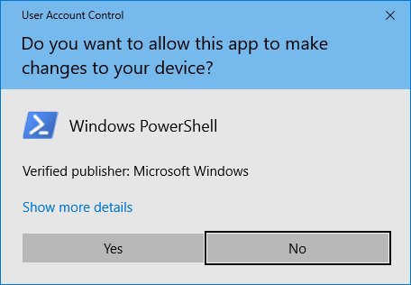

# Windows Installer

Installation on Windows for ShiftLeft tools (`sl` and .NET microagent) may be done using the installer available from the website.

## Installing

Use [this installer](https://cdn.shiftleft.io/download/installer-dotnet-framework-latest-windows-x64.zip) for .NET Framework installations or [this installer](https://cdn.shiftleft.io/download/installer-dotnet-core-latest-windows-x64.zip) for .NET Core installations. Simply unpack the downloaded archive and an executable will appear.

The choice between .NET Core and .NET Framework is a setting specific to the .NET microagent only, we provide two executables with different defaults for ease of installation.

The installer requires a user with administrator privileges. It will copy `sl.exe` into the global programs directory (specifically `%ProgramFiles%\ShiftLeft`), create a start menu entry with a shortcut to open a shell with `sl.exe` in its path (the folder will be called `ShiftLeft` too), as well as an uninstall shortcut; the .NET microagent will be separately installed into `C:\shiftleftDotNetAgent`.

In case the installer is run from the command line the flag `--no-prompt` may be added to skip the prompt waiting for user input that's usually there to allow users to read the installer output when running it without a terminal.

At this time the installer can simply be executed by double-clicking and confirming when the dialog for elevated privileges pops up afterwards.

It will print its output on a terminal window; once done, pressing `Enter` again or closing the window will finish the installer.

## Uninstalling

Uninstalling the ShiftLeft tools can be done similarly by double-clicking the start menu entry for the uninstaller. Here again the elevated privileges prompt needs to be confirmed.

Once confirmed (with `Enter`, respectively `Y` at the second prompt to also uninstall the .NET microagent) it will then proceed to undo the installation. Simply pressing `Ctrl-C` or closing the window will instead abort the uninstaller.

Again the window will stay open at the end until `Enter` is pressed, or the window is closed.
