# Enabling Jira Integration

You can integrate Jira with ShiftLeft to create Jira tickets for the vulnerabilities in your ShiftLeft Dashboard.

## Requirements

- Jira user must be in the *jira-administrators* group.
- At least one Jira project for which you want to use ShiftLeft to create tickets.
- At least one ShiftLeft application. 

## Installation

1. Log into your ShiftLeft account from https://www.shiftleft.io/login.
2. Open the Integrations page by clicking on the Settings icon on the Toolbar.

3. Select Jira from Available Integrations by clicking on the associated + icon.

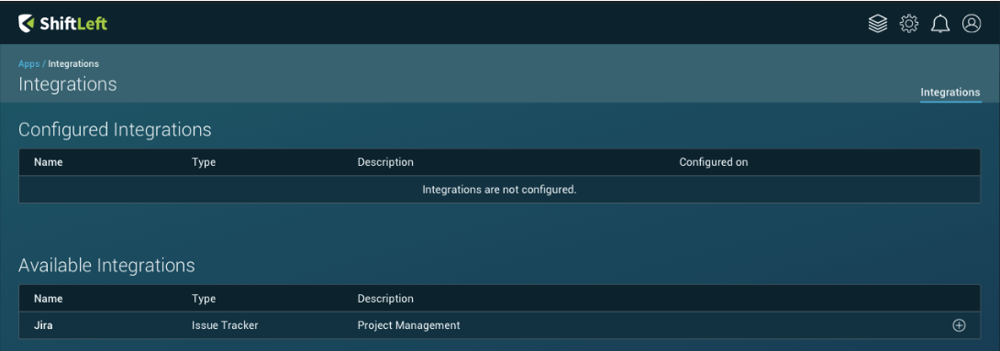

4. Choose the *ShiftLeft Project* for which you want to enable Jira integration from the dropdown menu.
5. Enter your *Jira Org* URL to create a secure connection. The URL should be similar to https://shiftleft.atlassian.net.
6. Click *Continue*.

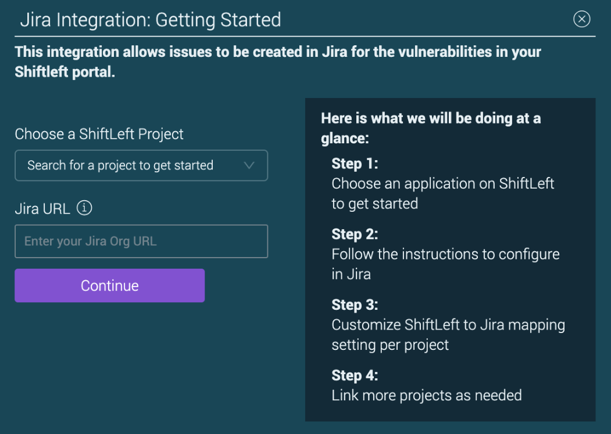

## Configuration

### Creating a Link from Jira

1. From Jira, using a new tab, open *Configure Application Links*.

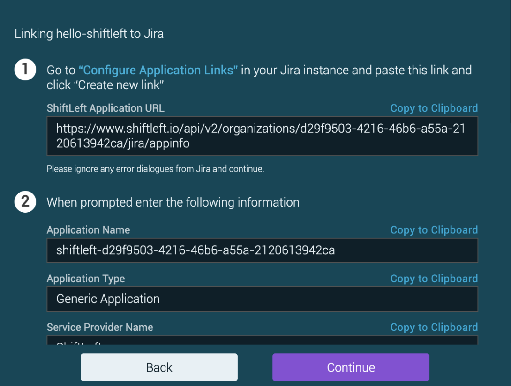

2. In the field, enter your ShiftLeft Application URL (it should be similar to https://shiftleft.atlassian.net/plugins/servlet/applinks/listApplicationLinks) and then click *Create new link*.

If you receive a “No response…” message, it can be ignored since the integration will still work. Just click *Continue* to dismiss this message.

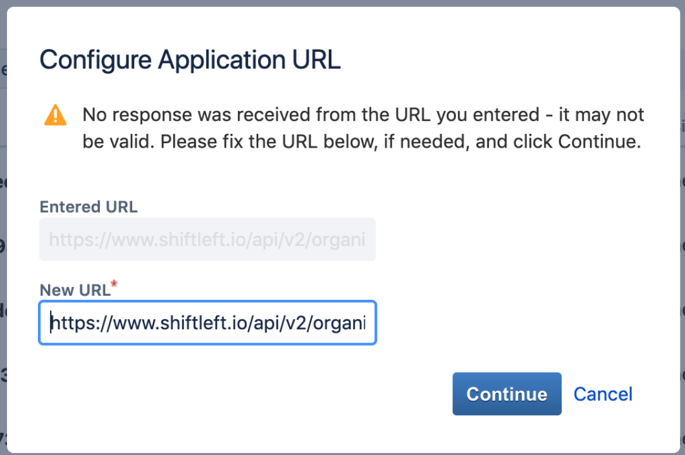

3. From the Link Applications page, enter the appropriate information in the fields using the corresponding values from the ShiftLeft Configuration screen. Check *Create incoming link*, and then click *Continue*.

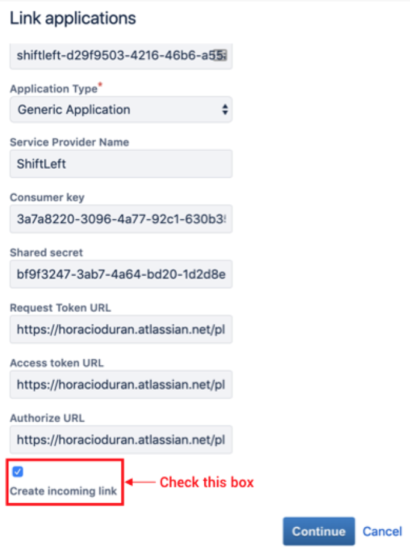

4. In the next page, enter the appropriate information in the three fields and click *Continue*.

A confirmation dialog indicates that the Application Link is successfully created.

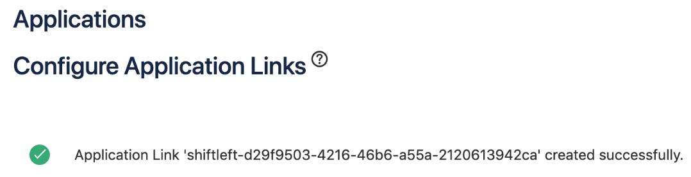

### Allowing the Jira Link from ShiftLeft

1. From your ShiftLeft Dashboard click *Continue*.
2. Click *Allow* to enable ShiftLeft to have read and write access to your Jira project. 
(Note: Clicking *Deny* disrupts the integration flow and may require support from ShiftLeft).

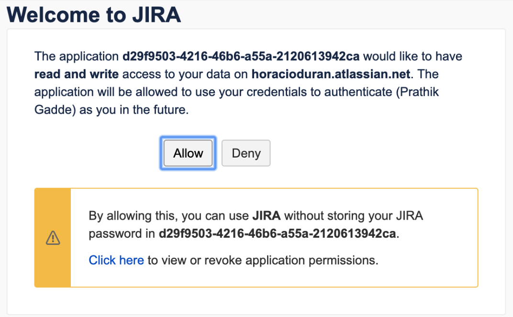

## Enabling Two-way Integration

Existing Jira issues can not be displayed in the ShiftLeft Dashboard. However, once a Jira ticket is created for a ShiftLeft  vulnerability, any and all changes to that particular Jira ticket is automatically updated in the ShiftLeft Dashboard.

1. From Jira, choose the project for which you want to create tickets from ShiftLeft. 

2. Select your Default Priority and Default State settings.

Default Priority. The priority of the Jira ticket according to the SiftLife severity definition.
Default State. How ShiftLeft treats any state change for Jira tickets.

3. Specify how the ticket should be displayed in Jira (ex: Bug, Task, Epic, etc).

4. Click *Continue* to save and complete the two-way integration.
You can change these settings at any time from in the Manage Integration page.

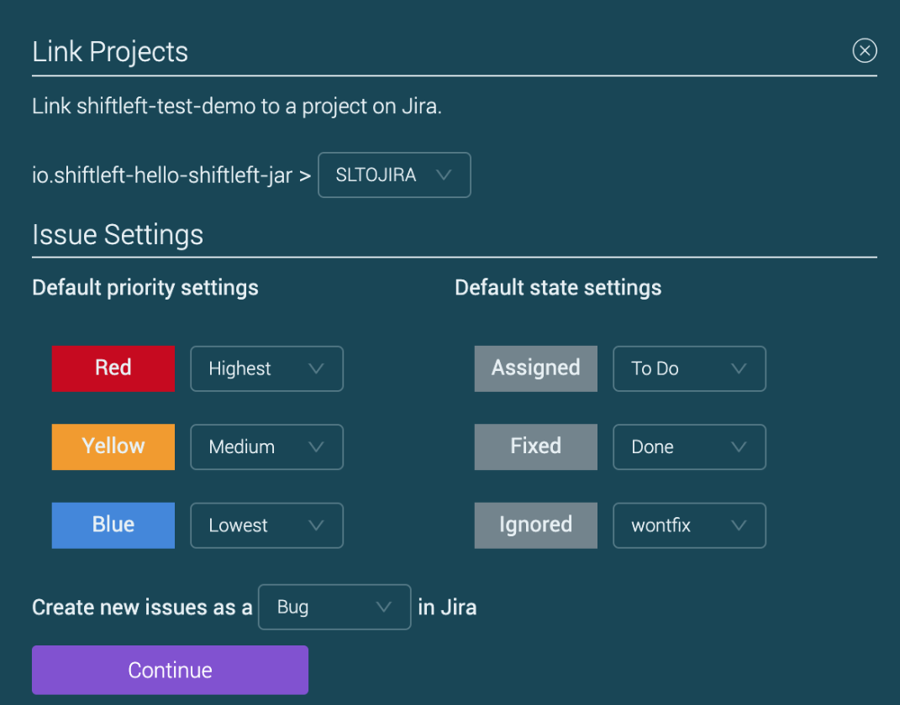

## Enabling Jira Integration for Additional Projects

1. From ShiftLeft, open the Integrations page by clicking on the Settings icon.
2. Click on the + icon associated with the new ShiftLeft project for which you want to enable Jira integration.
3. Click *Allow* to enable ShiftLeft to have read and write access to your Jira project.
4. Enable Two-way Integration (as explained above).

## Creating Jira Tickets from the ShiftLeft Dashboard

Once Jira Integration is enabled, you create Jira tickets from the ShiftLeft Dashboard.

- From the ShiftLeft Vulnerabilities page, click *Send to Jira* associated with the vulnerability for which you want to create a Jira ticket.
A message confirms that a Jira ticket is now linked to that specific vulnerability. 

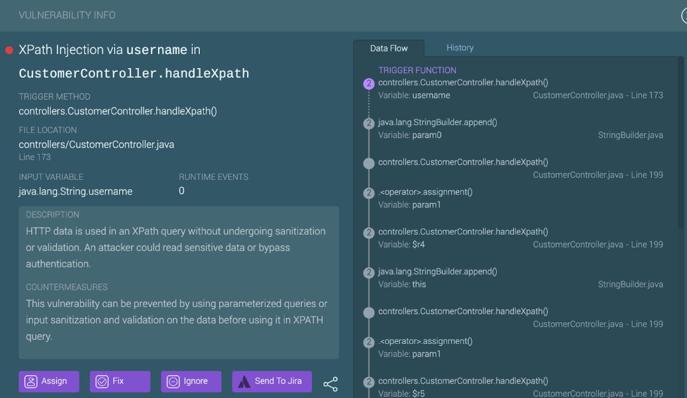

Status changes in Jira are automatically reflected on the ShiftLeft Dashboard.

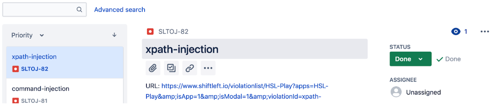

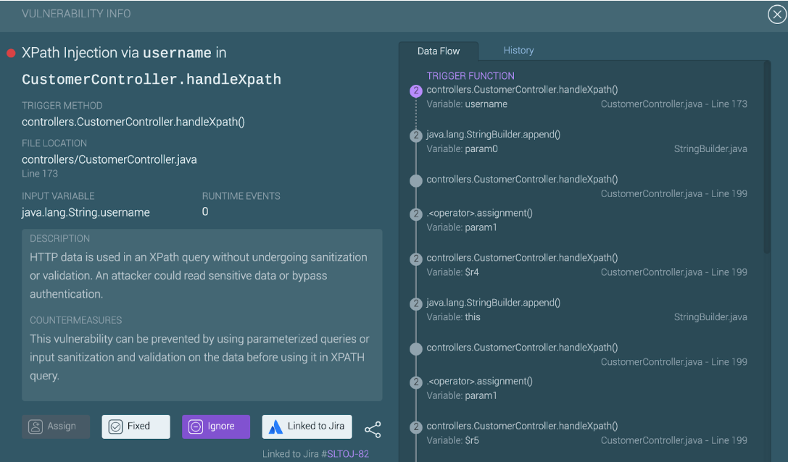

