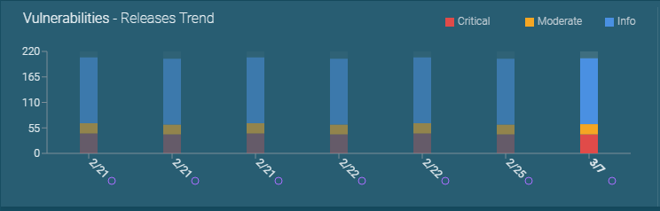
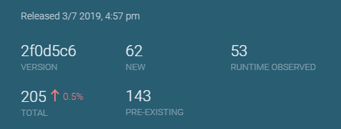

# Vulnerability Dashboard: Measure security quality of releases over time

Vulnerability Dashboard is a singular view of application security quality metrics including a list of vulnerabilities based on static/runtime analysis of applications. Engineering and AppSec teams can use these metrics to measure progress of their security improvement over time.

Vulnerability dashboard offers *three principal metrics*:

## Progressive build (security) quality
It is measured by the number of vulnerabilities fixed in the nth build vs n-1 build. In general, one could perform custom comparisions between any two builds. This helps measure progress (or decline) of security quality between releases.

## Security regression testing
ShiftLeft reports number of new vulnerabilities and reintroduced vulnerabilities in the latest build. This allows engineering leaders to measure how many security issues escaped regression testing.

## Runtime observed vulnerabilities
Vulnerability dashboard also reports the number of vulnerabilities that have associated runtime traffic events in QA test or production. This metric can help developers prioritize vulnerabilities in addition to using the criticality of the vulnerabilities. Incidentally, as we found out with our beta customers, reduction in this number was highly correlated with reduction in number of app exploit attempts over time.
*In addition to the three metrics discussed above*, vulnerability dashboard provides a list of vulnerabilities that can be filtered and sorted on multiple criteria including severity, location of the vulnerabilities, number of security events, number of blocked attempts to exploit the vulnerability, etc.

By clicking on any of the vulnerability, a pop-up shows detailed vulnerability characteristics — trigger method, file location, input variable, number of times vulnerability was observed in runtime, recommended countermeasure and data flow associated with the vulnerability.

Developers and Application security teams can use this information to take action on a particular vulnerability.
